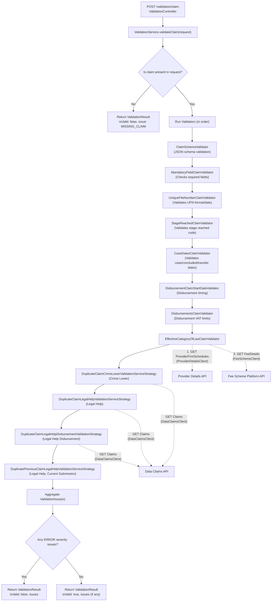

# System Flow: Claims Validation API POC

# Claims Validation Service Data Flow (Detailed)

This flow describes the precise, code-based sequence for a REST POST to `/validation/claim`, including all validators and their external dependencies.

## Step-by-step Data Flow

---

## Validator Details & External Dependencies

| Validator Name                        | Purpose/Checks                                                                 | External Calls/Dependencies                |
|----------------------------------------|-------------------------------------------------------------------------------|--------------------------------------------|
| ClaimSchemaValidator                   | Validates claim against JSON schema                                           | None                                       |
| MandatoryFieldClaimValidator           | Checks all required fields for area of law                                    | None (uses config registries)              |
| UniqueFileNumberClaimValidator         | Validates UFN format and that date is in the past                             | None                                       |
| StageReachedClaimValidator             | Validates stage reached code by area of law                                   | None                                       |
| CaseDatesClaimValidator                | Validates case start/concluded/transfer/rep order dates                       | None                                       |
| DisbursementClaimStartDateValidator    | Validates disbursement claims are after allowed period                        | None                                       |
| DisbursementsClaimValidator            | Validates disbursement VAT is within allowed limits                           | None                                       |
| EffectiveCategoryOfLawClaimValidator   | Validates provider is contracted for category of law for fee code             | **ProviderDetailsClient** (Provider API), **FeeSchemeClient** (Fee Scheme API) |
| DuplicateClaimCrimeLowerValidationServiceStrategy | Checks for duplicate Crime Lower claims (current submission and previous submissions) | **DataClaimsClient** (Claims API, for previous submissions) |
| DuplicateClaimLegalHelpValidationServiceStrategy | Checks for duplicate Legal Help claims (previous submissions) | **DataClaimsClient** (Claims API, for previous submissions) |
| DuplicateClaimLegalHelpDisbursementValidationStrategy | Checks for duplicate Legal Help disbursement claims (previous submissions) | **DataClaimsClient** (Claims API, for previous submissions) |
| DuplicatePreviousClaimLegalHelpValidationServiceStrategy | Checks for duplicate Legal Help claims within the current submission | None (in-memory only) |

**External API Call Details:**
- **ProviderDetailsClient.getProviderFirmSchedules**: Calls Provider Details API to get provider's contracted categories of law.
- **FeeSchemeClient.getFeeDetails**: Calls Fee Scheme Platform API to get fee code details and associated category of law.
- **DataClaimsClient.getClaims**: Calls Claims API to search for duplicate claims in previous submissions (by office, fee code, UFN, etc). If the API is unavailable, a technical error is returned.

---

#### Duplicate Claim Checks: Detailed Logic

- **DuplicateClaimCrimeLowerValidationServiceStrategy**
  - Checks for duplicates within the current submission (in-memory) and in previous submissions (via Data Claims API).
  - Calls `DataClaimsClient.getClaims(...)` for previous submissions.
- **DuplicateClaimLegalHelpValidationServiceStrategy**
  - Checks for duplicates in previous submissions (via Data Claims API).
  - Disbursement claims are handled by a separate strategy.
- **DuplicateClaimLegalHelpDisbursementValidationStrategy**
  - Only applies to disbursement claims.
  - Checks for duplicates in previous submissions (via Data Claims API).
- **DuplicatePreviousClaimLegalHelpValidationServiceStrategy**
  - Checks for duplicates within the current submission (in-memory only).

All other validators are purely in-memory and do not call external services. The only external dependencies in the validation flow are the Provider Details API, Fee Scheme Platform API, and Claims API (for duplicate checks), called by the `EffectiveCategoryOfLawClaimValidator` and the duplicate claim validation strategies listed above.

The order of validators is determined by their `priority()` method (schema first, then required fields, then business rules, then duplicate checks in the order shown above).

---

*This replaces the previous generic diagram and table with a precise, code-based flow and explicit mapping of validators to external dependencies.*

