# Validator Analysis: `CaseDatesClaimValidator`

> Canonical, source-traceable specification produced by reverse engineering the validator and
> **all** reachable validation logic. Intended for audit, developer reference, and future AI-to-AI
> comparison against replacement validators.
>
> **This revision reflects the parity changes made to align the validator with the legacy
> event-service behaviour and the authoritative Case Start Date business rule.** See
> §18 "Change Log / Parity Notes".
>
> Source of truth (analysed):
> - `validator/claim/rules/CaseDatesClaimValidator.java`
> - `validator/claim/rules/ClaimValidator.java`, `validator/Validator.java`
> - `validator/claim/ClaimValidationContext.java`, `validator/AbstractValidationContext.java`
> - `validator/claim/ClaimValidatorCode.java`, `validator/claim/ClaimValidationError.java`
> - `error/ValidationError.java`
> - `util/DateUtils.java`, `util/StringCaseUtil.java`, `util/FeeTypeUtils.java`
> - `config/MandatoryFieldsRegistry.java`
> - `model/Claim.java`, `model/ValidationIssue.java`, `model/ValidationSeverity.java`,
>   `model/FeeCalculationType.java`
> - `uk.gov.justice.laa.dstew.payments.claimsdata.model.AreaOfLaw` (external artifact — constants
>   confirmed: `CRIME_LOWER`, `LEGAL_HELP`, `MEDIATION`)
> - **Collaborating validators referenced (own part of the Case Start Date rule):**
>   `validator/claim/rules/MandatoryFieldClaimValidator.java`,
>   `validator/claim/rules/DisbursementClaimStartDateValidator.java`
>
> Callers of the validator are intentionally **not** analysed. The validator is treated as the
> system entry point.

---

## 1. Purpose

`CaseDatesClaimValidator` validates the four case-related date fields on a `Claim`:

1. **Case Start Date** — *not applicable for `CRIME_LOWER`*; range-checked for `LEGAL_HELP`/`MEDIATION`.
2. **Case Concluded Date**
3. **Transfer Date**
4. **Representation Order Date**

It records date problems as `ValidationIssue` objects on the supplied `ClaimValidationContext`.
It performs **no** external service calls and returns `void`; results are accumulated as a side
effect on the context.

> **Distributed business rule note.** The complete "Case Start Date" business rule is enforced by
> three collaborating validators. This validator owns only the **range** check. See §1.1.

### 1.1 Case Start Date — authoritative business rule and ownership

| Sub-rule | Applies to | Owned by |
|---|---|---|
| Mandatory (blank → error) | `LEGAL_HELP`, `MEDIATION` | `MandatoryFieldClaimValidator` (field `caseStartDate` is in `MandatoryFieldsRegistry` for those areas) — **and** additionally flagged here as `INVALID_DATE_FORMAT` |
| Valid date within `01/01/1995 … today` | `LEGAL_HELP`, `MEDIATION` (and any non-`CRIME_LOWER`/null area) | **`CaseDatesClaimValidator`** (this validator) |
| `caseStartDate + 3 months` must not exceed the submission-period cutoff | DISB-ONLY claims (`feeCalculationType == DISB_ONLY`) | `DisbursementClaimStartDateValidator` (`DISBURSEMENT_TOO_EARLY`) |
| Not applicable | `CRIME_LOWER` | Case Start Date is skipped here and is not in the `CRIME_LOWER` mandatory registry |

---

## 2. Validator Entry Point

| Property | Value | Source |
|---|---|---|
| Method | `void validate(Claim claim, ClaimValidationContext context)` | `CaseDatesClaimValidator.java` |
| Interface | `ClaimValidator extends Validator<Claim, ClaimValidationContext>` | `ClaimValidator.java` |
| `priority()` | `100` (lower runs first) | `CaseDatesClaimValidator.java` |
| `getValidatorCode()` | `ClaimValidatorCode.CLAIM_CASE_DATES_VALIDATOR` | `CaseDatesClaimValidator.java` |
| `appliesTo(scope)` (inherited default) | Runs when `scope == null` **or** `scope.isEmpty()` **or** `scope.contains(CLAIM_CASE_DATES_VALIDATOR)` | `Validator.java` |

---

## 3. Inputs

### 3.1 `Claim` fields read

| Field | Type | Used for |
|---|---|---|
| `areaOfLaw` | `AreaOfLaw` (`CRIME_LOWER`, `LEGAL_HELP`, `MEDIATION`) | Case Start Date applicability; Case Concluded floor |
| `caseStartDate` | `String` (`yyyy-MM-dd`) | Case Start Date rule (non-`CRIME_LOWER`) |
| `caseConcludedDate` | `String` (`yyyy-MM-dd`) | Case Concluded Date rule |
| `submissionPeriod` | `String` (`MMM-yyyy`, case-insensitive) | Gates/bounds Case Concluded Date rule |
| `transferDate` | `String` (`yyyy-MM-dd`) | Transfer Date rule (optional) |
| `representationOrderDate` | `String` (`yyyy-MM-dd`) | Representation Order Date rule (optional) |

`ClaimValidationContext.feeCalculationType` is **not** read by this validator (it is used by the
sibling `DisbursementClaimStartDateValidator`).

### 3.2 Constants (`CaseDatesClaimValidator`)

| Constant | Value |
|---|---|
| `OLDEST_DATE_ALLOWED` | `1995-01-01` |
| `EARLIEST_CASE_CONCLUDED_DATE_ALLOWED` | `2013-04-01` |
| `MIN_REP_ORDER_DATE` | `2016-04-01` |

### 3.3 Clock / "today"

`DateUtils.now()` derives "today" from a static, test-overridable `Clock`
(`DateUtils.setClock/resetClock`). Production uses `Clock.systemDefaultZone()`. All date
comparisons in this validator flow through `DateUtils.now()`; there are no direct `LocalDate.now()`
calls, so "today"/"future" behaviour is deterministic under a fixed clock in tests.

---

## 4. Outputs

- **Return type:** `void`.
- **Effect:** zero or more `ValidationIssue` objects appended to `context` via
  `context.addValidationIssues(...)`.
- Every issue produced by reachable paths has `severity = ERROR`.
- `context.getIssues()` de-duplicates by `path` (first occurrence wins; `null` paths always kept).
  Each date field maps to a distinct `path`, so the four rules never suppress one another.
- `path` values: `case_start_date`, `case_concluded_date`, `transfer_date`,
  `representation_order_date` (derived by `StringCaseUtil.toSnakeCase(fieldName)`).

---

## 5. Dependencies Analysed

| Class | Method(s) | Purpose | Rules |
|---|---|---|---|
| `DateUtils` | `validateDateInPast` → `validateDateBetween` → `parseDate`, `isDateWithinRange`, `createDateIssue`, `getDateError` | Past/range date validation | BR-002, BR-008, BR-009 |
| `DateUtils` | `checkDateNotInFutureAndWithinAllowedPeriod`, `getTwentiethOfNextMonth` (private, **null-safe**), `parseSubmissionPeriod`, `submissionPeriodCutoffDate` | Submission-period-bounded validation | BR-003 … BR-007 |
| `DateUtils` | `now()` / `Clock` | "Today" reference | Boundary semantics |
| `StringCaseUtil` | `toSnakeCase` | Issue `path` | Path derivation |
| `ClaimValidationError` | enum + `getDateError` | Error codes/messages | Message mapping |
| `ValidationError` | `toValidationIssue`, `toValidationIssueWithTechnicalMessage` | Builds `ValidationIssue` | Code = enum name; message = `String.format(display, params)` |
| `AbstractValidationContext` | `addValidationIssues`, `getIssues`, `hasErrors` | Accumulation + path dedupe | Dedup-by-path |
| `Claim`, `AreaOfLaw` | getters / enum | Inputs / branch selectors | BR-001, BR-005 |

**Collaborating validators (own other parts of the Case Start Date rule — not invoked by this
validator):** `MandatoryFieldClaimValidator` (mandatory presence), `DisbursementClaimStartDateValidator`
(DISB-ONLY 3-month timing).

**External service calls:** none. **Reflection / dynamic config:** none on the validation path.

---

## 6. Validation Flow Overview

Execution is sequential with no early returns. Rules execute in order (subject to guards):

1. **Case Start Date** — validated only when `areaOfLaw != CRIME_LOWER`
   (`validateDateInPast`, floor `1995-01-01`, ceiling today). Blank → `INVALID_DATE_FORMAT`.
2. **Case Concluded Date** — when the value is non-blank, the **period-independent** checks always
   run (format, not-future, not-before the area-of-law floor), so an invalid concluded date is
   never silently accepted — even if this validator runs in an isolated scope. The
   **period-dependent** upper bound (≤ 20th of the month following the submission period) is applied
   only when the submission period is present and parseable.
3. **Transfer Date** — only when non-blank (`validateDateInPast`, floor `1995-01-01`, ceiling today).
4. **Representation Order Date** — only when non-blank (`validateDateInPast`, floor `2016-04-01`,
   ceiling today).

**Short-circuit note:** within Case Concluded Date the precedence is first-match-wins:
unparseable → future → before-earliest → after-cutoff.

**No uncaught-exception path:** a blank or malformed submission period no longer throws — the
period-dependent upper bound is simply skipped (see §11).

---

## 7. Mermaid Flow Diagram

```mermaid
flowchart TD
    Start([validate claim, context]) --> AoL[Read areaOfLaw]

    %% Case Start Date
    AoL --> CSD_Applies{areaOfLaw == CRIME_LOWER?}
    CSD_Applies -->|Yes| CCD_Guard[Skip Case Start Date - N/A]
    CSD_Applies -->|No| CSD_Parse{Case Start Date parseable?}
    CSD_Parse -->|No / blank / null| CSD_FmtFail[[Issue INVALID_DATE_FORMAT case_start_date  BR-001/002]]
    CSD_Parse -->|Yes| CSD_Range{Within 1995-01-01 .. today?}
    CSD_Range -->|No| CSD_RangeFail[[Issue INVALID_CASE_START_DATE  BR-002]]
    CSD_Range -->|Yes| CCD_Guard
    CSD_FmtFail --> CCD_Guard
    CSD_RangeFail --> CCD_Guard

    %% Case Concluded Date
    CCD_Guard --> CCD_HasVal{concluded date non-blank?}
    CCD_HasVal -->|No| TD_Guard
    CCD_HasVal -->|Yes| CCD_ParseTry{parseable?}
    CCD_ParseTry -->|No| CCD_Fmt[[Issue INVALID_CASE_CONCLUDED_DATE 'Invalid date value'  BR-007]]
    CCD_ParseTry -->|Yes| CCD_Future{after today?}
    CCD_Future -->|Yes| CCD_Fut[[future date  BR-004]]
    CCD_Future -->|No| CCD_Early{before earliest? CRIME_LOWER=2016-04-01 else 2013-04-01}
    CCD_Early -->|Yes| CCD_EarlyFail[[cannot be before earliest  BR-005]]
    CCD_Early -->|No| CCD_PeriodOk{submissionPeriod parseable?}
    CCD_PeriodOk -->|No / blank / malformed| TD_Guard
    CCD_PeriodOk -->|Yes| CCD_Late{after 20th of next month?}
    CCD_Late -->|Yes| CCD_LateFail[[cannot be later than 20th...  BR-006]]
    CCD_Late -->|No| TD_Guard
    CCD_Fmt --> TD_Guard
    CCD_Fut --> TD_Guard
    CCD_EarlyFail --> TD_Guard
    CCD_LateFail --> TD_Guard

    %% Transfer Date
    TD_Guard{Transfer Date non-blank?}
    TD_Guard -->|No| ROD_Guard
    TD_Guard -->|Yes| TD_Parse{parseable?}
    TD_Parse -->|No| TD_Fmt[[INVALID_DATE_FORMAT transfer_date  BR-008]]
    TD_Parse -->|Yes| TD_Range{Within 1995-01-01 .. today?}
    TD_Range -->|No| TD_RangeFail[[INVALID_TRANSFER_DATE  BR-008]]
    TD_Range -->|Yes| ROD_Guard
    TD_Fmt --> ROD_Guard
    TD_RangeFail --> ROD_Guard

    %% Representation Order Date
    ROD_Guard{Rep Order Date non-blank?}
    ROD_Guard -->|No| End
    ROD_Guard -->|Yes| ROD_Parse{parseable?}
    ROD_Parse -->|No| ROD_Fmt[[INVALID_DATE_FORMAT representation_order_date  BR-009]]
    ROD_Parse -->|Yes| ROD_Range{Within 2016-04-01 .. today?}
    ROD_Range -->|No| ROD_RangeFail[[INVALID_REPRESENTATION_ORDER_DATE  BR-009]]
    ROD_Range -->|Yes| End
    ROD_Fmt --> End
    ROD_RangeFail --> End

    End([return void])
```



---

## 8. Validator Fingerprint

- **Total Rules:** 9 (BR-001 … BR-009)
- **Critical Rules:** all 9 (every reachable issue is `ERROR`)
- **External Dependencies:** none
- **Internal Dependencies:** `DateUtils`, `StringCaseUtil`, `ClaimValidationError`, `AreaOfLaw`
- **Validation Sequence:**
  1. Validate Case Start Date (skipped for `CRIME_LOWER`; `1995-01-01 … today`)
  2. Validate Case Concluded Date (submission-period gated; area-of-law floor; ≤ 20th of following month)
  3. Validate Transfer Date (optional, `1995-01-01 … today`)
  4. Validate Representation Order Date (optional, `2016-04-01 … today`)
- **Rule Catalogue:** BR-001 … BR-009

---

## 9. Validation Rules (Natural Language)

- **BR-001** — Case Start Date is **not applicable** for `CRIME_LOWER`. For `LEGAL_HELP`/`MEDIATION`
  (and any non-`CRIME_LOWER`/null area) it must be present and parseable as `yyyy-MM-dd`; a null,
  blank, or unparseable value fails with `INVALID_DATE_FORMAT`.
- **BR-002** — For non-`CRIME_LOWER` claims, Case Start Date must be on or after `1995-01-01` and on
  or before today (inclusive).
- **BR-003** — Case Concluded Date is validated whenever the value is non-blank. The
  format/future/before-floor checks (BR-004/005/007) are **period-independent** and always run; the
  submission-period upper bound (BR-006) additionally requires a parseable submission period.
- **BR-004** — Case Concluded Date must not be later than today (period-independent).
- **BR-005** — Case Concluded Date must not be earlier than: `2016-04-01` when
  `areaOfLaw == CRIME_LOWER`, otherwise `2013-04-01` (period-independent).
- **BR-006** — Case Concluded Date must not be later than the 20th day of the month following the
  submission period. **Applied only when the submission period parses as `MMM-yyyy`**; otherwise
  skipped (the submission period's own validity is a submission-scope concern).
- **BR-007** — A non-blank but unparseable Case Concluded Date raises an "invalid date value" error
  (period-independent).
- **BR-008** — Transfer Date is optional; when non-blank it must be parseable and within
  `1995-01-01 … today` (inclusive).
- **BR-009** — Representation Order Date is optional; when non-blank it must be parseable and within
  `2016-04-01 … today` (inclusive).

> Only the **first** failing condition among BR-004/005/006 is reported for the concluded date.

---

## 10. Decision Tables

### 10.1 Case Start Date (BR-001, BR-002)

| areaOfLaw | Condition | Result | Code | Message |
|---|---|---|---|---|
| `CRIME_LOWER` | any value | Pass (skipped) | — | — |
| non-`CRIME_LOWER`/null | Null / blank / unparseable | Fail | `INVALID_DATE_FORMAT` | `Invalid date value provided for Case Start Date` |
| non-`CRIME_LOWER`/null | Parses, `< 1995-01-01` or `> today` | Fail | `INVALID_CASE_START_DATE` | `Case Start Date must be between 01/01/1995 and today` |
| non-`CRIME_LOWER`/null | Parses, `1995-01-01 ≤ d ≤ today` | Pass | — | — |

### 10.2 Case Concluded Date (BR-003 … BR-007)

Let `E` = earliest (`CRIME_LOWER → 2016-04-01`, else `2013-04-01`); `C` = 20th of month after the
submission period; `T` = today.

| submissionPeriod | concluded value | Sub-condition | Result | Message |
|---|---|---|---|---|
| any | blank/null | — | Pass (skipped) | — |
| any | unparseable | — | Fail | `Invalid date value provided for Case Concluded Date` |
| any | `d > T` | future | Fail | `Case Concluded Date cannot be a future date` |
| any | `d ≤ T`, `d < E` | too early | Fail | `Case Concluded Date cannot be before <E dd/MM/yyyy>` |
| null / blank / malformed | `d ≤ T`, `d ≥ E` | cutoff not checkable | Pass | — |
| parseable | `d ≤ T`, `d ≥ E`, `d > C` | too late | Fail | `Case Concluded Date cannot be later than the 20th of the month following the submission period` |
| parseable | `d ≤ T`, `d ≥ E`, `d ≤ C` | in range | Pass | — |

> The format, future (BR-004) and before-floor (BR-005) checks apply for **any** submission period
> value (including null/blank/malformed) — they are period-independent. Only the cutoff check
> (BR-006) requires a parseable submission period.

### 10.3 Transfer Date (BR-008) / Representation Order Date (BR-009)

| Field | Blank | Unparseable | Out of range | Code (range) |
|---|---|---|---|---|
| Transfer Date | Pass | Fail `INVALID_DATE_FORMAT` | `<1995-01-01` or `>today` → Fail | `INVALID_TRANSFER_DATE` (`… between 01/01/1995 and today`) |
| Representation Order Date | Pass | Fail `INVALID_DATE_FORMAT` | `<2016-04-01` or `>today` → Fail | `INVALID_REPRESENTATION_ORDER_DATE` (`… between 01/04/2016 and today`) |

---

## 11. Exception Handling

| Exception | Origin | Handled? | Outcome |
|---|---|---|---|
| `DateTimeParseException` (concluded date value) | `LocalDate.parse` in `checkDateNotInFutureAndWithinAllowedPeriod` | **Caught** | `INVALID_CASE_CONCLUDED_DATE` "invalid date value" (BR-007) |
| `DateTimeParseException` (date value) | `parseDate` in `validateDateBetween` | **Caught** (debug-logged, returns `null`) | `INVALID_DATE_FORMAT` |
| Submission period blank / malformed | `getTwentiethOfNextMonth` → `parseSubmissionPeriod` | **Null-safe** (returns `null`; no throw) | Case Concluded validation skipped |
| `NullPointerException` | getters if `claim == null` | Not caught | Propagates (validator does not null-check the claim) — see §12 |

> **Resolved:** the previously-latent uncaught `IllegalArgumentException` / `DateTimeParseException`
> for a non-null-but-blank or malformed submission period has been eliminated.
> `checkDateNotInFutureAndWithinAllowedPeriod` now parses via `parseSubmissionPeriod` (returns
> `null` for blank/unparseable) and skips validation, delegating submission-period format
> validation to the dedicated submission-period validator.

---

## 12. Human Review Items

| # | Location | Reason | Status |
|---|---|---|---|
| HR-1 | `CaseDatesClaimValidator.validate` | No null-check on `claim`; `claim.getAreaOfLaw()` NPEs if `claim == null`. `ClaimValidation.validateClaim` guards null before invoking validators, so this is not reachable in the pipeline; confirm no other caller passes null. | `HUMAN_REVIEW_REQUIRED` (low) |
| HR-2 | `AreaOfLaw` | External artifact; constants confirmed for current version (`CRIME_LOWER`, `LEGAL_HELP`, `MEDIATION`). Re-verify if the artifact version changes. | Verified for current version |

Previously-listed items now **resolved**: uncaught submission-period exception (fixed, §11);
Rep Order logging defect (fixed — now logs `getRepresentationOrderDate()`); Case Start Date
applicability for `CRIME_LOWER` (fixed, BR-001).

---

## 13. Validation Scenarios

Assume `today = 2026-07-29` unless a fixed clock is stated.

| ID | Description | Input | Expected | Rules |
|---|---|---|---|---|
| SC-01 | All valid, LEGAL_HELP | start=`2020-01-01`, concluded=`2025-06-15`, period=`JUN-2025`, transfer=`2020-02-01`, rep=`2020-03-01` | 0 issues | BR-002/005/006/008/009 |
| SC-02 | Case Start blank, LEGAL_HELP | start=`""` | Fail `INVALID_DATE_FORMAT` (case_start_date) | BR-001 |
| SC-03 | Case Start blank, MEDIATION | start=`""` | Fail `INVALID_DATE_FORMAT` | BR-001 |
| SC-04 | Case Start blank, **CRIME_LOWER** | start=`""` | **No case_start_date issue** | BR-001 |
| SC-05 | Case Start out-of-range, **CRIME_LOWER** | start=`1990-01-01` | **No case_start_date issue** | BR-001 |
| SC-06 | Case Start unparseable, **CRIME_LOWER** | start=`2003-13-34` | **No case_start_date issue** | BR-001 |
| SC-07 | Case Start before floor, LEGAL_HELP | start=`1994-12-31` | Fail `INVALID_CASE_START_DATE` | BR-002 |
| SC-08 | Case Start floor boundary | start=`1995-01-01` | Pass (start) | BR-002 |
| SC-09 | Case Start future | start=`2999-01-01` | Fail `INVALID_CASE_START_DATE` | BR-002 |
| SC-10 | Concluded skipped: no period | period=`null`, concluded=`1990-01-01` | Pass (concluded skipped) | BR-003 |
| SC-11 | Concluded skipped: blank value | period=`JUN-2025`, concluded=`""` | Pass (concluded skipped) | BR-003 |
| SC-12 | **Concluded skipped: blank/malformed period (no throw)** | period=`" "` or `2025-06`, concluded=`2025-05-15` | No throw; no concluded issue | BR-003 |
| SC-13 | Concluded future | period=`JUN-2025`, concluded=`2999-01-01` | Fail future | BR-004 |
| SC-14 | Concluded too early (non-crime) | LEGAL_HELP, period=`JUN-2025`, concluded=`2013-03-31` | Fail before `01/04/2013` | BR-005 |
| SC-15 | Concluded too early (CRIME_LOWER) | CRIME_LOWER, period=`APR-2016`, concluded=`2016-03-31` | Fail before `01/04/2016` | BR-005 |
| SC-16 | Concluded after cutoff | period=`JAN-2026`, concluded=`2026-02-21` | Fail later-than-20th | BR-006 |
| SC-17 | Concluded on cutoff boundary | period=`JAN-2026`, concluded=`2026-02-20` | Pass | BR-006 |
| SC-18 | Concluded unparseable | period=`JUN-2025`, concluded=`not-a-date` | Fail invalid value | BR-007 |
| SC-19 | Concluded future with **fixed clock** | clock=`2025-05-10`, period=`MAY-2025`, concluded=`2025-05-11` | Fail future (deterministic) | BR-004 |
| SC-20 | Transfer skipped when blank | transfer=`""` | Pass | BR-008 |
| SC-21 | Transfer out of range | transfer=`1994-01-01` | Fail `INVALID_TRANSFER_DATE` | BR-008 |
| SC-22 | Rep order out of range | rep=`2016-03-31` | Fail `INVALID_REPRESENTATION_ORDER_DATE` | BR-009 |
| SC-23 | Rep order boundary | rep=`2016-04-01` | Pass | BR-009 |
| SC-24 | **DISB-ONLY too early** (sibling validator) | DISB_ONLY, start=`2023-01-15`, period=`JAN-2023` | `DISBURSEMENT_TOO_EARLY` | §1.1 |
| SC-25 | **DISB-ONLY within window** (sibling validator) | DISB_ONLY, start=`2022-10-01`, period=`JAN-2023` | No `DISBURSEMENT_TOO_EARLY` | §1.1 |

Scenarios SC-02…SC-06, SC-12, SC-19, SC-24, SC-25 are covered by automated tests (see §14).

---

## 14. Test Coverage

**Unit — `CaseDatesClaimValidationTest`**
- Happy path; invalid formats; out-of-range past/future for all fields; concluded-date
  boundary matrix across all areas of law (parameterised).
- **New:** blank Case Start Date rejected for `LEGAL_HELP`/`MEDIATION`; Case Start Date not
  applicable for `CRIME_LOWER` (blank/out-of-range/unparseable); malformed/blank submission period
  does not throw; deterministic future-date check via injected `Clock`; **invalid concluded date
  (future / before-floor / unparseable) still flagged when the submission period is
  absent/malformed** (isolated-scope safety).

**Unit — `DateUtilsTest`**
- `checkDateNotInFutureAndWithinAllowedPeriod`: **new** period-independent checks fire without a
  valid submission period (future, before-earliest, unparseable); in-range value with no period
  returns empty (only the cutoff is skipped); blank/whitespace/malformed period never throws.
- `getTwentiethOfNextMonth`: **updated** — returns `null` instead of throwing for blank/unparseable
  input.

**Integration — `CaseStartDateRuleIntegrationTest`**
- Runs `MandatoryFieldClaimValidator` + `DisbursementClaimStartDateValidator` +
  `CaseDatesClaimValidator` in priority order over a shared context, asserting the distributed
  Case Start Date rule: mandatory for `LEGAL_HELP`/`MEDIATION`; range-checked; not applicable for
  `CRIME_LOWER`; DISB-ONLY 3-month timing rejection/acceptance.

Full module suite: **1088 tests passing**.

---

## 15. Canonical Validation Specification (machine-readable)

```yaml
validator: CaseDatesClaimValidator
validator_code: CLAIM_CASE_DATES_VALIDATOR
priority: 100
severity_of_all_issues: ERROR
external_calls: none
today_reference: DateUtils.now()   # static, test-overridable clock

rules:
  - id: BR-001
    description: Case Start Date is not applicable for CRIME_LOWER; for LEGAL_HELP/MEDIATION (and non-CRIME_LOWER/null) it must be present and parseable as yyyy-MM-dd.
    inputs: [areaOfLaw, caseStartDate]
    failure_condition: areaOfLaw != CRIME_LOWER AND (caseStartDate is null OR blank OR not parseable)
    outcome: Reject
    code: INVALID_DATE_FORMAT
    path: case_start_date
    notes: Presence for LEGAL_HELP/MEDIATION is additionally owned by MandatoryFieldClaimValidator.

  - id: BR-002
    description: For non-CRIME_LOWER, Case Start Date must be between 1995-01-01 and today inclusive.
    inputs: [areaOfLaw, caseStartDate, today]
    failure_condition: areaOfLaw != CRIME_LOWER AND (date < 1995-01-01 OR date > today)
    outcome: Reject
    code: INVALID_CASE_START_DATE
    path: case_start_date

  - id: BR-003
    description: Case Concluded Date is validated whenever the value is non-blank. Format/future/before-floor checks are period-independent; the cutoff (BR-006) additionally requires a parseable submission period.
    inputs: [submissionPeriod, caseConcludedDate]
    outcome: Skip only when concluded value blank

  - id: BR-004
    description: Case Concluded Date must not be after today.
    failure_condition: date > today
    outcome: Reject
    code: INVALID_CASE_CONCLUDED_DATE
    message: "Case Concluded Date cannot be a future date"
    path: case_concluded_date

  - id: BR-005
    description: Case Concluded Date must not be before the area-of-law floor (CRIME_LOWER=2016-04-01 else 2013-04-01).
    failure_condition: date < floor
    outcome: Reject
    code: INVALID_CASE_CONCLUDED_DATE
    path: case_concluded_date

  - id: BR-006
    description: Case Concluded Date must not be after the 20th of the month following the submission period. Applied only when submissionPeriod parses as MMM-yyyy; otherwise skipped.
    failure_condition: submissionPeriod parseable AND date > submissionPeriodCutoffDate
    outcome: Reject
    code: INVALID_CASE_CONCLUDED_DATE
    path: case_concluded_date

  - id: BR-007
    description: A non-blank Case Concluded Date must be parseable as yyyy-MM-dd.
    failure_condition: value non-blank AND not parseable
    outcome: Reject
    code: INVALID_CASE_CONCLUDED_DATE
    message: "Invalid date value provided for Case Concluded Date"
    path: case_concluded_date

  - id: BR-008
    description: Transfer Date optional; if non-blank must parse and fall within 1995-01-01..today inclusive.
    failure_condition: non-blank AND (not parseable OR date < 1995-01-01 OR date > today)
    outcome: Reject
    codes: [INVALID_DATE_FORMAT, INVALID_TRANSFER_DATE]
    path: transfer_date

  - id: BR-009
    description: Representation Order Date optional; if non-blank must parse and fall within 2016-04-01..today inclusive.
    failure_condition: non-blank AND (not parseable OR date < 2016-04-01 OR date > today)
    outcome: Reject
    codes: [INVALID_DATE_FORMAT, INVALID_REPRESENTATION_ORDER_DATE]
    path: representation_order_date

related_rules_owned_elsewhere:
  - id: EXT-CASE-START-MANDATORY
    description: Case Start Date mandatory presence for LEGAL_HELP/MEDIATION.
    owner: MandatoryFieldClaimValidator
    code: MISSING_MANDATORY_FIELD
  - id: EXT-DISB-ONLY-TIMING
    description: DISB-ONLY claims fail if caseStartDate + 3 months > submission period cutoff.
    owner: DisbursementClaimStartDateValidator
    code: DISBURSEMENT_TOO_EARLY

evaluation_order: [BR-001, BR-002, BR-003, BR-004, BR-005, BR-006, BR-007, BR-008, BR-009]
concluded_date_branch_precedence: [BR-007, BR-004, BR-005, BR-006]   # first match wins (unparseable, future, before-earliest, after-cutoff)
boundary_semantics: inclusive on all floors/ceilings and on the cutoff (== passes)
submission_period_handling: >
  null-safe. Concluded-date format/future/before-floor checks are period-independent and always run;
  only the 20th-of-next-month upper bound requires a parseable submission period. The submission
  period's own validity (mandatory/format/min-period/not-current-or-future) is owned by the
  submission-scope validators (SubmissionPeriodValidator + SubmissionSchemaValidator).
```

---

## 16. Confidence Assessment

**Confidence Rating: High.**

All validation logic reachable from the entry point was traced to source, including the collaborating
validators that own the mandatory-presence and DISB-ONLY timing portions of the Case Start Date rule.
The prior confidence-reducing items (uncaught submission-period exception, intent of blank Case Start
Date, `CRIME_LOWER` applicability) are now resolved and covered by automated tests. The only residual
item is the null-claim contract (guarded upstream by `ClaimValidation`).

### Coverage Summary

| Metric | Detail |
|---|---|
| Classes analysed | 15 core + `AreaOfLaw` (external) + 2 collaborating validators |
| Branches analysed | Case Start applicability + range (3), Case Concluded gate + 3-way else-if + parse catch (6), Transfer (3), Rep Order (3), area-of-law ternary (2) |
| Rules extracted | 9 (BR-001 … BR-009) + 2 externally-owned related rules |
| Human review items | 2 (both low) |
| Tests | Unit (`CaseDatesClaimValidationTest`, `DateUtilsTest`) + Integration (`CaseStartDateRuleIntegrationTest`); full suite 1088 passing |

---

## 17. Failure Conditions Summary

| Code | Severity | Path | Reachable via |
|---|---|---|---|
| `INVALID_DATE_FORMAT` | ERROR | `case_start_date` / `transfer_date` / `representation_order_date` | Blank/unparseable Case Start (non-CRIME_LOWER); unparseable Transfer/Rep-Order |
| `INVALID_CASE_START_DATE` | ERROR | `case_start_date` | Case Start out of `[1995-01-01, today]` (non-CRIME_LOWER) |
| `INVALID_CASE_CONCLUDED_DATE` | ERROR | `case_concluded_date` | Future / too-early / too-late / unparseable concluded date |
| `INVALID_TRANSFER_DATE` | ERROR | `transfer_date` | Transfer out of `[1995-01-01, today]` |
| `INVALID_REPRESENTATION_ORDER_DATE` | ERROR | `representation_order_date` | Rep Order out of `[2016-04-01, today]` |

---

## 18. Change Log / Parity Notes

Changes applied to reach parity with the authoritative Case Start Date rule and the legacy
event-service validator:

1. **Case Start Date now Not Applicable for `CRIME_LOWER`** — the range check is skipped when
   `areaOfLaw == CRIME_LOWER`. For `LEGAL_HELP`/`MEDIATION` (and any non-`CRIME_LOWER`/null area)
   the value remains mandatory (blank → `INVALID_DATE_FORMAT`, plus mandatory-field enforcement) and
   range-checked (`1995-01-01 … today`). The DISB-ONLY `+3 months` timing rule remains owned by
   `DisbursementClaimStartDateValidator`.
2. **Submission-period handling made null-safe** — `DateUtils.checkDateNotInFutureAndWithinAllowedPeriod`
   now parses via `parseSubmissionPeriod` and skips (no throw) for blank/malformed periods; the
   private `getTwentiethOfNextMonth` returns `null` instead of throwing.
3. **Concluded-date checks decoupled from the submission period (scope-safety fix)** — the
   format, not-future and before-floor checks (BR-004/005/007) now run whenever a concluded-date
   value is present, regardless of the submission period. Only the "20th of the month following the
   submission period" upper bound (BR-006) is conditional on a parseable submission period.
   Previously *all* concluded-date checks were gated behind a valid submission period, meaning an
   invalid concluded date (future / pre-floor / unparseable) could be silently accepted when the
   validator ran in an isolated claim scope. The submission period's own validity remains a
   submission-scope responsibility (`SubmissionPeriodValidator` + `SubmissionSchemaValidator`), by
   design — a claim-level validator does not re-validate submission-level fields.
4. **Representation Order Date debug log fixed** — now logs the representation order date (was
   logging the transfer date).
5. **Clock** — confirmed all "today"/"future" comparisons flow through the injectable
   `DateUtils` clock; deterministic tests added using a fixed clock.
6. **Tests** — unit and integration tests added/updated to cover every rule and edge case above,
   including isolated-scope invalid concluded dates; full module suite green (1088 tests).

Items intentionally **not** changed (per direction): error codes/paths, `source` tagging,
path-based de-duplication behaviour, and `areaOfLaw` sourcing (`claim.getAreaOfLaw()`) — these were
confirmed acceptable as-is.


