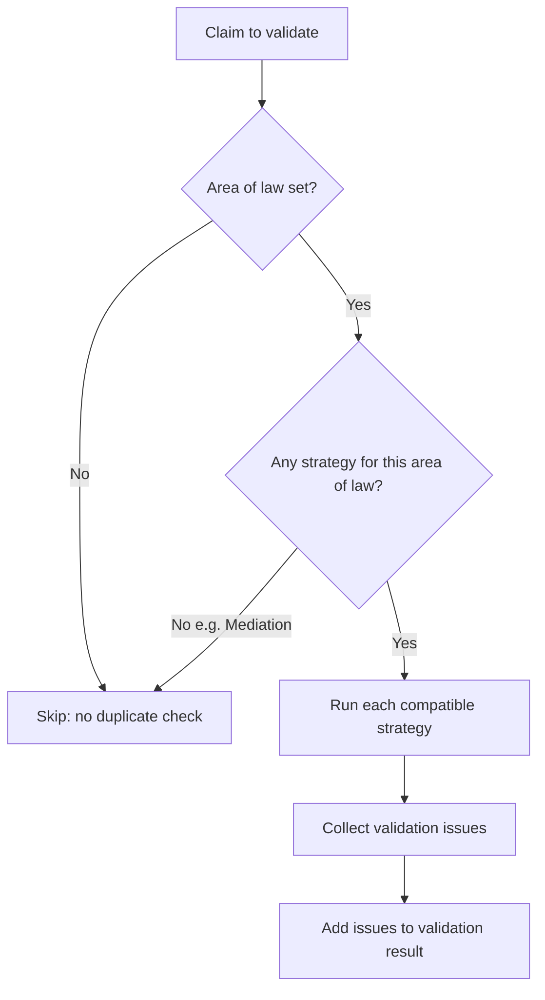
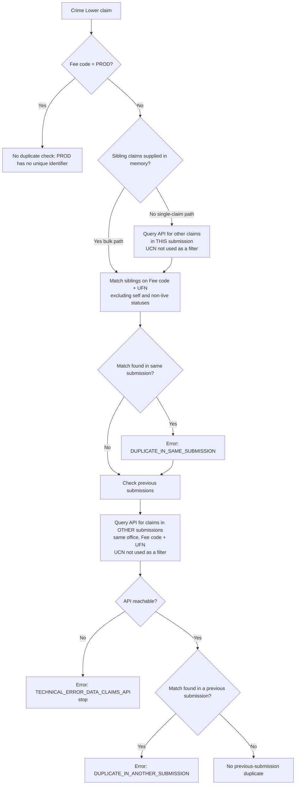
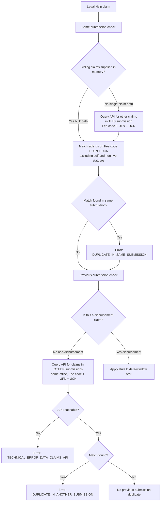
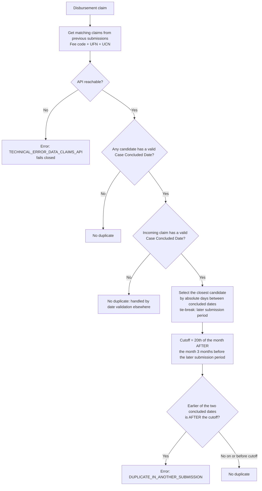

# DuplicateClaimValidator

## Purpose

Detects whether a claim is a **duplicate** of another claim — either another claim in the
**same submission** or a claim in a **previously stored submission** for the same office. Detection
rules differ by **area of law** (Crime Lower vs Legal Help), and Legal Help disbursements use a
special date-window rule.

This document describes the *current* behaviour of the validator for business confirmation.

---

## Key concepts (read first)

**Two ways a claim arrives for validation**

| Path | How it is triggered | Where sibling claims come from |
|---|---|---|
| **Bulk / list path** | A whole submission is validated at once | Siblings are supplied **in memory** (the other claims in the batch) |
| **Single-claim path** | One claim is validated on its own | No siblings supplied — the validator **queries the Data Claims API** for other claims in the same submission |

Both paths ultimately apply the same matching rules; they only differ in *where* the "same
submission" claims are found.

**Two kinds of duplicate (two error codes)**

| Situation | Error raised |
|---|---|
| A matching claim exists **in the same submission** | `INVALID_CLAIM_HAS_DUPLICATE_IN_SAME_SUBMISSION` |
| A matching claim exists **in a previous submission** | `INVALID_CLAIM_HAS_DUPLICATE_IN_ANOTHER_SUBMISSION` |
| The Data Claims API cannot be reached | `TECHNICAL_ERROR_DATA_CLAIMS_API` |

**Only "live" claims can be duplicates.** A stored claim is only considered a possible duplicate
when:

- its **claim status** is `READY_TO_PROCESS` or `VALID`, and
- its parent **submission status** is one of `CREATED`, `VALIDATION_IN_PROGRESS`,
  `READY_FOR_VALIDATION`, or `VALIDATION_SUCCEEDED`.

Claims in any other status (e.g. `INVALID`, void) are ignored.

**A claim is never its own duplicate.** The claim being validated is always excluded from the
comparison set (in the bulk path by value equality; in the single-claim path by claim id).

---

## Which rules run for which area of law

| Area of law | Strategies that run | Duplicate check performed |
|---|---|---|
| **Crime Lower** | Crime Lower strategy | Same submission **and** previous submission |
| **Legal Help** (non‑disbursement) | LH same‑submission + LH previous‑submission | Same submission **and** previous submission |
| **Legal Help** (disbursement) | LH same‑submission + LH disbursement (Rule B) | Same submission **and** previous submission (date‑window) |
| **Mediation** | *(none registered)* | **No duplicate check at all** |

> For Legal Help, the disbursement vs non‑disbursement split is decided by the claim's **fee type**.
> The non‑disbursement previous‑submission check and the disbursement (Rule B) check are mutually
> exclusive — each short‑circuits when the claim is not its kind.

### Matching keys

| Area of law | Fields that must match to be a duplicate |
|---|---|
| **Crime Lower** | Fee code **+** Unique File Number (UFN) |
| **Legal Help** | Fee code **+** UFN **+** Unique Client Number (UCN) |
| **Legal Help disbursement (Rule B)** | Fee code **+** UFN **+** UCN, *then* a Case Concluded Date window test |

> **Note (Crime Lower):** the Unique Client Number is deliberately **not** part of the Crime Lower
> key. Two Crime Lower claims with the same fee code + UFN but a different client are still treated
> as duplicates.

---

## High‑level flow

The validator runs **late** (priority 10000) so that other validators have already populated the
claim, and it applies to all claim scopes.

---

## Crime Lower — decision tree

Key points for BA confirmation:

- **PROD fee code is always skipped** — no same‑submission or previous‑submission check, and no API
  call is made.
- Crime Lower matches on **fee code + UFN only** — client number is intentionally ignored, on both
  the same‑submission and previous‑submission checks.
- If **either** API lookup fails (same‑submission on the single‑claim path, or previous‑submission),
  a **technical error** is raised and the claim is **not** passed as a non‑duplicate (fails closed).

---

## Legal Help — decision tree

### Rule B — Legal Help disbursement date window

Rule B only applies to **disbursement** claims and adds a **Case Concluded Date** proximity test on
top of the fee code + UFN + UCN match.

Rule B points for BA confirmation:

- The check needs a **valid Case Concluded Date on both** the incoming claim and at least one
  candidate; otherwise no duplicate is raised (missing/invalid dates are caught by other
  validation).
- The "anchor" candidate is the one whose concluded date is **closest** to the incoming claim's; if
  two are equally close, the one from the **later submission period** wins.
- The cutoff is derived from the **later** of the two submission periods, minus 3 months, taken to
  the **20th of the following month**.
- The claim is a duplicate only when the **earlier** of the two concluded dates falls **strictly
  after** the cutoff. A date **on** the cutoff is **accepted** (not a duplicate).

**Worked example**

- Later submission period = JAN‑2026
- Minus 3 months → OCT‑2025
- Cutoff = **20 NOV‑2025** (20th of the month after OCT‑2025)
- Earlier concluded date of **21 NOV‑2025** → **duplicate**
- Earlier concluded date of **20 NOV‑2025** or before → **not a duplicate**

---

## Mediation

No Mediation duplicate strategy is registered, so Mediation claims receive **no duplicate check**
and **no Data Claims API call** is made. This is intentional.

---

## Data source & query parameters

When the validator needs stored claims it calls the Data Claims API (`getClaims`) with:

| Parameter | Value |
|---|---|
| Office account number | The claim's office |
| Submission id | The claim's own submission (same‑submission check) / omitted (previous‑submission check) |
| Submission statuses | `CREATED`, `VALIDATION_IN_PROGRESS`, `READY_FOR_VALIDATION`, `VALIDATION_SUCCEEDED` |
| Fee code | The claim's fee code |
| Unique File Number | The claim's UFN |
| Unique Client Number | The claim's UCN for **Legal Help**; **omitted (null)** for **Crime Lower** |
| Claim statuses | `READY_TO_PROCESS`, `VALID` |

For the previous‑submission check, any rows belonging to the claim's own submission are removed from
the results before matching.

---

## Edge cases & guarantees

- **Self‑exclusion:** the claim under validation is never reported as its own duplicate.
- **Status filtering:** only `READY_TO_PROCESS` / `VALID` claims in eligible submissions are
  considered.
- **PROD fee code (Crime Lower):** skipped entirely, no API call.
- **API unavailable (fails closed):** if *any* Data Claims API lookup — same‑submission **or**
  previous‑submission — cannot be completed, the claim is **not** passed. A
  `TECHNICAL_ERROR_DATA_CLAIMS_API` issue is raised. This error carries a stable technical message
  (the underlying exception detail is logged with its stack trace, not attached to the issue), so
  identical failures from several lookups on the same claim de‑duplicate to a single reported issue.
  No duplicate outcome is inferred.
- **Mediation:** no duplicate validation performed.

---

## Priority & scope

- **Priority:** 10000 — runs very late, after other validators, so it can consider fully populated
  claims.
- **Scope:** applies to all claim scopes.

---

## Notes for maintainers

- Duplicate detection is area‑of‑law specific and pluggable. New strategies implement
  `DuplicateClaimValidationStrategy`, declare their `compatibleAreaOfLaws()`, and are registered as
  beans (wired via the library auto‑configuration).
- Each strategy receives the current claim, the in‑memory related claims (empty on the single‑claim
  path), the office code, and the fee type.
- Shared query/matching helpers live in `DuplicateClaimValidation`. The unique‑client‑number filter
  is passed explicitly so that Crime Lower can omit it (fee code + UFN key) while Legal Help includes
  it (fee code + UFN + UCN key).
